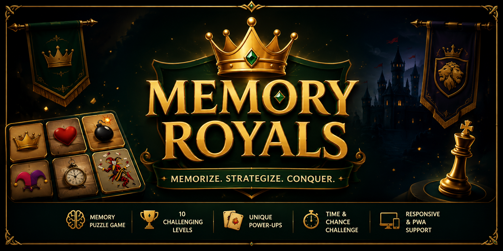
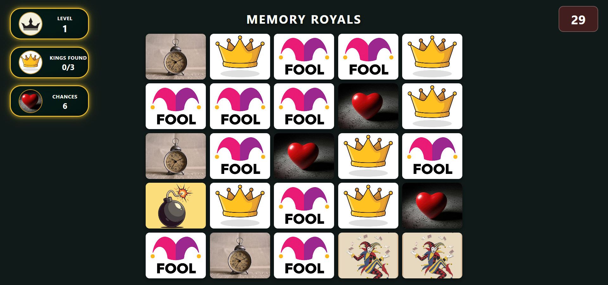
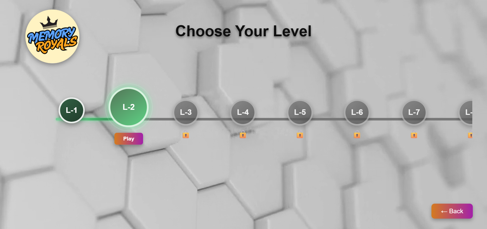
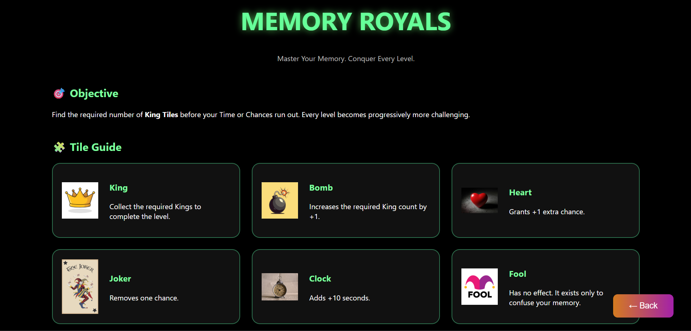
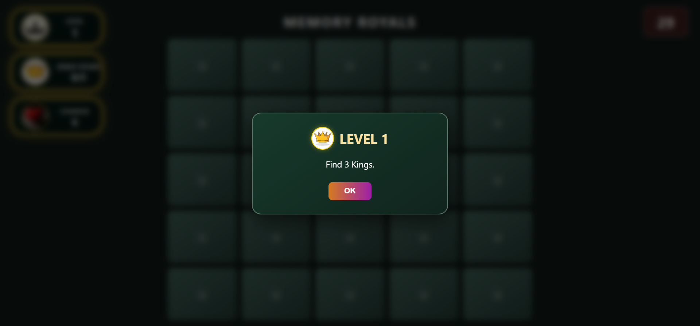
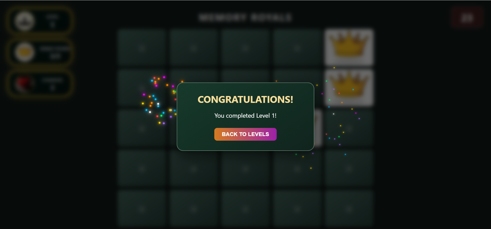

  

<h1 align="center">Memory Royals</h1>

A browser-based memory puzzle game built with HTML, CSS, and JavaScript.

  

  

---

## Overview

Memory Royals is a browser-based memory puzzle game where players memorize the positions of hidden tiles before they are concealed. The objective is to uncover all the required King tiles while managing limited chances and time.

Each level introduces randomized tile placement and special tiles that can either help or challenge the player, creating a fresh gameplay experience every time.

The game is developed entirely using vanilla HTML, CSS, and JavaScript without any external frameworks or game engines.

---

## Screenshots

| Home | Gameplay |
|:----:|:--------:|
|  |  |

| Level Selection | Rules |
|:---------------:|:-----:|
|  |  |

| Level Objective | Victory |
|:---------------:|:--------:|
|  |  |

---

## Features

- 10 progressively challenging levels
- Randomized gameplay for high replayability
- Interactive tile mechanics
- Countdown timer with limited chances
- Smooth animations and sound effects
- Responsive design for desktop and mobile
- Progressive Web App (PWA) support
- Offline play after installation

---

## Special Tiles

| Tile | Description |
|------|-------------|
| 👑 King | Collect all required Kings to complete the level |
| ❤️ Heart | Grants one additional chance |
| 💣 Bomb | Increases the required King count |
| 🃏 Joker | Removes one remaining chance |
| ⏰ Clock | Adds extra time |
| 🤡 Fool | Has no effect and exists to confuse the player |

---

## Tech Stack

- HTML5
- CSS3
- JavaScript (ES6)
- Git
- GitHub Pages
- Progressive Web App (PWA)

---

## Future Improvements

- Online leaderboard
- Achievement system
- Additional game modes
- Difficulty selection
- Save game progress

---

## Author

**Soumik Ghosh**

B.Tech in Information Technology

GitHub: https://github.com/Smik395
